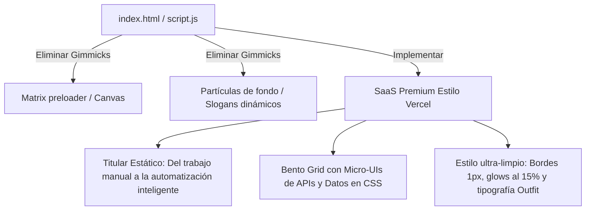

# Diseño Técnico: Rediseño Visual SaaS Premium para BENIA AGENCY

Especificación técnica de diseño para transformar la landing page de **BENIA AGENCY** de una estética genérica tipo "plantilla de IA" (AI Slop) en una interfaz premium, sobria y humana al estilo **SaaS Premium** (Vercel/Linear).

---

## 1. El Diagnóstico y la Propuesta de Valor

La landing page actual presenta clichés visuales que devalúan la percepción técnica de la agencia (cargador de pantalla Matrix, partículas flotando de fondo, máquina de escribir con slogans cíclicos, y luces HSL neón excesivas). 

Para erradicar esto y posicionar la marca como una boutique de ingeniería de alto valor, adoptamos el enfoque **SaaS Premium**:
* **Carga instantánea:** Eliminación del preloader lento de Matrix.
* **Tipografía editorial:** Uso de Outfit para encabezados y JetBrains Mono para micro-detalles.
* **Micro-UIs de alta fidelidad:** En lugar de imágenes genéricas de IA en el Bento Grid, inyectamos mini-interfaces interactivas y flujos lógicos maquetados en CSS/HTML que demuestran competencia técnica real.
* **Copywriting Humano:** Titular principal fijo de gran impacto enfocado al ROI y conversión directa.

---

## 2. Cambios Arquitectónicos y Estéticos

### 2.1. Eliminación de Elementos "AI Slop"
* **Preloader Matrix:** Eliminamos `#welcome-screen` en `index.html` y las funciones `initWelcomeScreen` y `startMatrixEffect` en `script.js`.
* **Partículas flotantes:** Eliminamos `#particles-container` y el bucle generador de partículas de `script.js`.
* **Motor de Slogans Dinámicos:** Eliminamos la variable `sloganPool` y el bucle `cycleSlogans` de `script.js`. El titular se cargará de forma estática en el HTML.
* **"SYS_ONLINE" Status:** Eliminamos el badge simulación-hacker de la navbar.

### 2.2. Nuevo Estilo de Hero y Copywriting
* **Headline Fijo:**
  * *H1 principal:* "Del trabajo manual a la automatización inteligente"
  * *Subtítulo:* "Convertimos operaciones complejas y repetitivas en sistemas autónomos y estables de IA. Reducción inmediata de hasta el 80% en costes operativos con total transparencia y control."
* **Botones CTA:** Formato rectangular premium con esquinas redondeadas calibradas a `8px`, colores de alto contraste (blanco puro con texto negro para el primario; fondo translúcido con borde sutil para el secundario).

### 2.3. Bento Grid con Micro-UIs en CSS (Servicios)
Reemplazamos las imágenes cuadradas de las tarjetas por cajas de interfaz en CSS de alta fidelidad:
* **Automatizaciones de IA:** Una simulación interactiva de workflow de API (Webhook CRM ➔ Conector de Make ➔ Registro exitoso en base de datos).
* **Landings Inteligentes:** Una micro-interfaz de captura de leads con gráfico de conversión CRO y test A/B en tiempo real.
* **Solución de Problemas:** Un panel de depuración lógica técnica con logs de consola y variables de optimización.
* **Mentorías Especializadas:** Un micro-bloque de calendario interactivo de reserva y líneas de código de prompts avanzados.

### 2.4. Pulido del Sistema CSS (`styles.css`)
* **Colores:** Mantenemos el negro carbón profundo y gris carbón, pero suavizamos los acentos de borde a `rgba(255, 255, 255, 0.04)`.
* **Resplandores (Mouse Glow):** Reducimos la opacidad máxima de `#global-mouse-glow` y `#hero-mouse-glow` del 55% al **15%**, aumentando el radio de dispersión (`blur`) para lograr una iluminación extremadamente sutil y premium.
* **Espaciados:** Incrementamos los padding verticales de las secciones para darles aire editorial e intelectual.

---

## 3. Plan de Verificación

* **Validación en Consola:** Comprobar que no hay errores de variables ausentes en `script.js` debido a la remoción de Matrix o partículas.
* **Rendimiento:** Verificar que la página carga instantáneamente, eliminando tiempos muertos de animación inicial.
* **Estética Visual:** Verificar en el navegador la asimetría de bordes, la suavidad del brillo del ratón y el funcionamiento de las nuevas micro-interfaces en CSS dentro de las tarjetas Bento.
